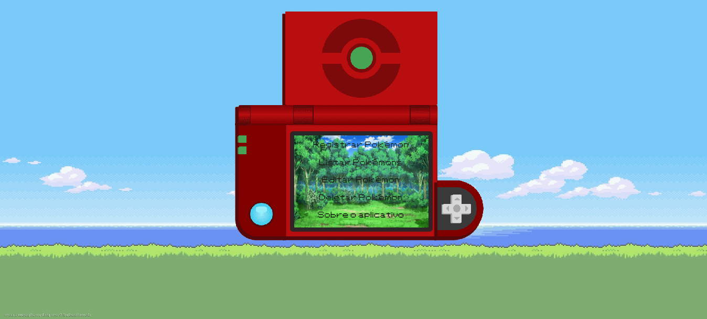

# Pokédex

## Objetivo
```
Este projeto foi criado para ser uma demonstração do básico de uma sistema.
Este app performa as quatro operações básicas de um banco de dados (Criar, Ler, Atualizar e Deletar).
Com um pequeno toque de nerdisse, optei por criar algo interessante, interativo e visualmente atrativo
```
## Tecnologias

```
Este app foi criado em Vue, sendo nele adicionado o Vuetify como biblioteca de UI.
Tailwind CSS para estilização.
API Java Spring Boot para seu funcionamento completo.
PostgreSQL como base de dados
```

## Tela Inicial


## Lista de Pokémons


## Project setup
```
npm install
```

### Compiles and hot-reloads for development
```
npm run serve
```

### Compiles and minifies for production
```
npm run build
```

### Lints and fixes files
```
npm run lint
```

### Customize configuration
See [Configuration Reference](https://cli.vuejs.org/config/).
